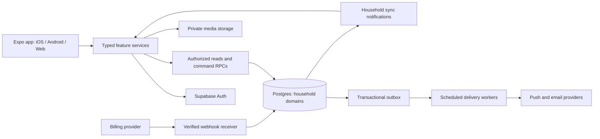
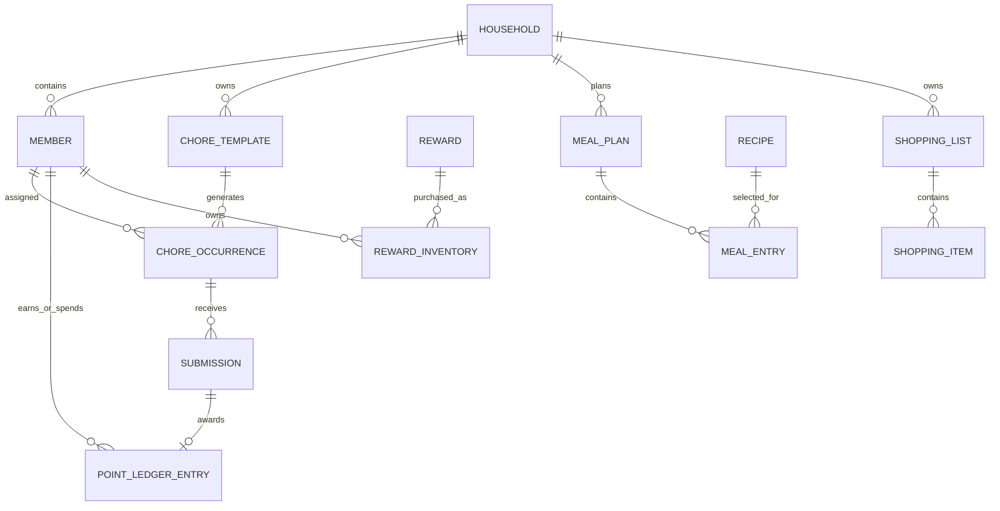

# HomeHuddle — Product Design, Architecture & Production Plan

Version 1.0 · September 15, 2026 · Prepared from the current local codebase

Companion: [Current-state improvement backlog](HomeHuddle-Improvement-Backlog-2026-09-15.md).

## 0. Decision and scope

**Build HomeHuddle into the household coordination product that gives families their time back.** Its core promise is: “Plan the week once. Everyone knows what to do, what is for dinner, and what needs buying.” Chores, meals, groceries, handoffs, and rewards should work together. The commercial opportunity is recurring relief from planning and follow-up, not the number of widgets on a screen.

Keep Expo, React Native, TypeScript, and Supabase. Complete the trustworthy shared-data foundation, simplify the daily experience, and then add automation that demonstrably removes work. Retain playful rewards as an optional participation tool. Do not make the experience depend on games, artificial urgency, or constant notifications.

Two deployment paths share one codebase and data model:

1. **Path A — $0 incremental vendor spend:** a constrained, web-first pilot on free services, with no paid Supabase plan, no paid AI, and no native store distribution. This is a credible validation route, not an unlimited production-service promise.
2. **Path B — economical managed production:** the same product on Supabase Pro, economical email delivery, native distribution when justified, and measured capacity upgrades. Spend first on reliability and the workflows people will pay to keep.

This document is a proposed target design and implementation plan. It does not assert that the target capabilities already exist. Prices are USD observations checked September 15, 2026; projections and feature prices are explicitly hypotheses. “Production quality” means passing measurable release gates, not a claim of perfection.

### Review baseline

| Item | Observed state |
|---|---|
| Workspace | `/Users/haewonkim/home/development/homehuddle` |
| Actual Git/app root | `/Users/haewonkim/home/development/homehuddle/HomeHuddle` |
| Current commit | `91f50ea`, detached HEAD |
| Local `main` | `dcf30b3`; 302 commits unique to HEAD and 7 unique to main |
| Uncommitted work | 22 modified tracked paths and 10 untracked entries; some entries are directories |
| Remote configuration | No Git remote configured |
| Intended GitHub destination | `kimhw8084/homehuddle`; both repository lookup and REST request returned not found/404 under authenticated user `kimhw8084` |
| Application | Expo 54, React 19.1, React Native 0.81.5, Expo Router 6, TypeScript 5.9, Zustand 5, Supabase JS 2.x |
| Structural source inventory | 82 first-party TS/TSX/JS files, approximately 30,805 lines including tests/scripts, excluding dependencies, generated exports, and archived code copies |
| Database | Seven migration files, plus incompatible legacy schema/seed scripts |
| Validation | TypeScript passes; Jest: 19 passed, 2 failed, 9 suites; lint: 57 errors, 415 warnings |
| Web export | Succeeds; entry JavaScript approximately 5.25 MB uncompressed; 3,072 modules |

Review coverage: all first-party source areas were inventoried and structurally scanned; routes, state ownership, API wiring, schema/migration chain, tests, configuration, legacy specifications, and the highest-risk business logic were inspected. Large UI files were reviewed through their component/handler structure and relevant implementations. Dependencies and generated bundles were not manually reviewed line by line. This is a repository-wide engineering review, not a formal security certification or exhaustive line-by-line audit.

No production database queries, schema changes, authentication attempts against real accounts, load tests against hosted systems, native-device UX tests, purchases, or deployments were performed. The database findings describe checked-in and untracked SQL, not verified deployed state. Existing source edits were preserved. The Supabase skills informed the privilege, pagination, transaction, and deployment analysis.

## 1. Product objectives and evidence model

### 1.1 Who it serves first

**Primary buyer:** an adult coordinating a busy household who currently remembers, assigns, reminds, and checks most of the work. Often two adults and one or more children, but avoid assuming gender, marriage, or a single family structure.

**Primary collaborator:** another adult who wants a clear handoff and an achievable list without being managed through messages.

**Secondary participant:** a teen using an independent account, or a younger child using an adult-managed profile. Children do not receive sales prompts. A household without children can disable rewards entirely.

**Later segments:** roommates, caregivers, and adults coordinating across homes. They require different privacy and permission models; do not quietly fold them into the first release.

### 1.2 Jobs and measurable outcomes

| Job | Product outcome | Initial validation target — not current performance |
|---|---|---|
| “Help us decide what happens this week.” | A confirmed plan with meals, responsibilities, and groceries | Returning household confirms a week in ≤5 minutes |
| “Tell me what needs my attention now.” | Role-aware Today view, approvals, handoff notes | Find the next action within 10 seconds |
| “Stop making me remind everyone.” | Assignments, digest, acknowledgments, escalation controls | ≥30% reduction in self-reported reminder messages after four weeks |
| “Do not make us enter the same thing twice.” | Templates and meal/chore-to-shopping connections | Add a common item or complete a simple task in ≤2 meaningful actions |
| “Keep the household in agreement.” | Durable state, clear ownership, fair workload | Changes survive restart and appear on a second active device within the sync target |
| “Make this worth paying for.” | Repeatable automation with visible usefulness | At least 10 pilot households voluntarily pay the tested price after using it |

North-star metric: **weekly households completing at least one coordinated plan and at least three useful shared actions involving two participants**. A one-adult household can qualify through a managed-profile workflow but should be analyzed as a separate cohort.

Supporting metrics: invite acceptance, time to first shared success, week-4/week-8 retention, weekly-plan completion, grocery reuse, approval turnaround, paid conversion, involuntary churn, refund rate, support minutes per household, and variable cost per active household. Record task completion time and an optional monthly time-saved survey. Never equate app taps with minutes saved or advertise an unvalidated savings claim.

### 1.3 Explicit product assumptions

- Start with English, US launch operations, and household-local time zones. Locale, currency, week-start, names, and units must be configurable in the architecture.
- One active household per authenticated account for v1; enforce it consistently. Preserve a membership model that can later support multiple homes.
- Points are noncash household units. No banking, cash custody, purchasable points, transferable money, or financial-return claims.
- An adult owns billing and household administration. Teen ownership transfer is excluded from the target policy even though current SQL permits it.
- A participant can leave safely; household owners do not own another adult’s private account information.
- The plan assumes one experienced full-time engineer plus part-time design/QA help. Dates below are estimates; release gates control shipment.

## 2. What the current project actually provides

| Area | Current implementation | Production gap |
|---|---|---|
| Authentication | Email link/code, configurable Google/Apple buttons, session listener, route guards | Two OTP tests have stale mock response shapes; callback/session error handling and real-platform flows need verification |
| Onboarding | Profile/family steps, household and managed-child creation, retry reconciliation | Reconciliation uses names; multiple household creation is not consistently constrained; invite requires a pasted token |
| Household administration | New account API and untracked migration implement invites, roles, transfer, removal, export, deletion | Deployment unknown; role policy, data lifecycle, concurrent membership changes, and deletion behavior need completion |
| Chores | Extensive filters, date views, recurrence UI, photos, bulk actions, games | Signed-in edit/delete/reschedule/reassignment explicitly blocked; some other interactions remain local |
| Chore backend | Create, submit, approve, reject, points award | Separate recurring occurrences and resubmission lifecycle missing; action-level permissions and invariant checks need tightening |
| Rewards | Backend create/buy/redeem; rich catalog UI | Stock, eligibility, discounts, edit/delete, gift/refund semantics do not match the server contract |
| Wallet | Server balance/ledger adapters plus local goals/charts | Identity and display data are conflated; historic values and goals require durable models |
| Meals/groceries | Recipe bank, voting, weekly menus, pantry selection, categorization, shopping UX | Primarily in-memory state; no matching current migration-backed shared domain |
| Home/family | Approvals, machine cards, automations, deliveries, announcements, pets, widgets | Most supporting domains remain seeded/local; one automation editor is a placeholder |
| Notifications | Device registration, preferences, transactional event rows | No delivery worker, receipt processing, retries, or full quiet-hour policy found |
| Billing | RevenueCat dependency and a small helper; entitlement table and recurring-chore gate in SQL | No found callers for configuration/purchase flow; no webhook reconciler; gate can deny features without a working upgrade path |
| Operations | Error boundary, development-only timing logger, staging SQL and k6 script | No production telemetry pipeline, complete CI, restore rehearsal, or release runbook found |

The UI is a valuable prototype with substantial interaction work. It must not be presented as a fully synchronized household product until its shared domains have durable ownership and tested server contracts.

### 2.1 Most consequential findings

1. **Database privilege compatibility:** the last migration revokes function execution broadly and regrants RPCs, but omits membership helpers referenced by read policies. The source chain therefore warrants an urgent authenticated-read permission check on a disposable database. Do not “fix” this by broadly restoring every function grant.
2. **Action authorization:** current completion and reward functions establish household membership but do not consistently implement self-versus-adult-on-behalf rules. Define the role matrix before completing these functions.
3. **Completion integrity:** zero-point chores are allowed while ledger amounts cannot be zero; the approval transaction can fail for such a chore. Rejected submissions retain a unique chore/date slot, with no resubmission command. These are source-level contract conflicts.
4. **Recurrence is not a production domain yet:** a single chore has one global status while the client projects repeated dates. Future tasks need independent occurrence identities and transitions.
5. **Mixed demo and authenticated state:** bootstrap replaces only part of a store initially populated with demo meals, groceries, announcements, and other content. Sign-out does not clear that domain store. Eliminate ambiguity and cross-account stale state.
6. **Identity loss:** adapters drop stable member IDs and roles such as owner into display names and `Parent`. Name-based lookups can misattribute data and collide after renames.
7. **False persistence:** several actions appear successful but only update local memory; those changes can disappear or diverge between devices.
8. **History correctness:** independent 100-row limits, active-only reward reads, and catalog-derived inventory labels can hide old or discontinued purchases. Snapshot historical values and paginate properly.
9. **Unfinished monetization:** recurrence is gated in SQL, but a working, server-reconciled purchase path was not found.
10. **Release health:** test and lint gates fail. Lint includes ten Rules of Hooks errors and 120 dependency warnings; these deserve behavioral review before formatting cleanup.

The companion backlog includes locations, remediation intent, dependencies, and acceptance criteria. Findings are defensive review observations; no live vulnerability reproduction was attempted.

## 3. Positioning and monetization

### 3.1 A differentiated reason to exist

Cozi already combines family organization and premium convenience, TimeTree centers shared calendars, and Sweepy centers cleaning and chore participation. HomeHuddle should connect **planning → assignment → completion → restock → next week**, including the handoff between adults. The differentiation is a workflow hypothesis, not evidence that competitors lack any particular feature. Sources: [Cozi](https://www.cozi.com/cozi-gold-features/), [TimeTree Premium](https://support.timetreeapp.com/hc/en-us/articles/4647239978905-What-is-TimeTree-Premium), [Sweepy](https://sweepy.com/).

Validate with 12–20 adult coordinators, then 20–50 consenting pilot households. Ask them to perform their actual weekly planning and shopping routines. Track where they still use chat, paper, or another app. Do not spend on acquisition until a meaningful cohort returns without repeated founder reminders.

### 3.2 Product packaging — independent of infrastructure plan

“Free infrastructure” and “free customer subscription” are different decisions. Path A can validate willingness to pay through interviews/waitlists, but collecting payments introduces processor fees and therefore violates a literal zero-cost constraint.

| Capability | HomeHuddle Free — proposed | Household Plus — proposed |
|---|---|---|
| Household | One home, up to six profiles initially | One home, up to twelve profiles initially |
| Shared basics | Chores, groceries, simple weekly menu, core rewards | All core capabilities |
| Repetition | Basic daily/weekly recurring chores | Flexible recurrence, rotations, vacation exceptions |
| Time-saving setup | Starter templates | Reusable household routines and one-tap weekly reuse |
| Connected workflows | Manual meal-to-list selection | Consolidated ingredients, reusable pantry rules, routine-to-restock actions |
| Coordination | In-app inbox and essential notifications where supported | Scheduled digest, handoff templates, configurable reminder policies |
| Reporting | Current balance and essential transaction history | Workload trends and extended planning insights |
| Data rights | Export, account deletion, member removal, security | Same rights; never paywall these |
| Media | Small, explicitly stated allowance | Larger bounded allowance; still compressed and retained deliberately |
| AI later | None required | Optional metered assist or separately priced credit bundle |

Test **$5.99/month or $49.99/year per household** as a starting hypothesis. Show the full annual charge beside any monthly equivalent. Offer the plan to the adult coordinator after a useful shared outcome or when they intentionally select an advanced feature. Trial length and payment requirements are experiments; use a clear 14-day trial only once cancellation, receipts, and entitlement expiration work.

Basic recurrence belongs in Free because it creates the repeat-use habit. This intentionally changes the current SQL rule that gates every non-null recurrence. Premium value should come from less planning, smarter reuse, and coordination automation.

Use one subscription sponsor per household initially. If billing ownership changes, existing entitlement remains tied to the verified subscription until the sponsor cancels, expires, or completes an explicit transfer supported by the billing provider. Never duplicate entitlements or silently transfer a charge to another adult.

### 3.3 Revenue expansion sequence

1. Earn retention with chores + weekly plan + groceries.
2. Sell household-wide automation and reusable routines.
3. Test annual conversion after successful use, not during first-run setup.
4. Offer optional high-cost AI import/assistance only with a usage budget and proven utility.
5. Consider multi-home coordination once consent and membership isolation support it.
6. Consider adult-only referral partnerships for relevant household services after core revenue works; disclose incentives and never sell household data.

Do not introduce ads to children, randomized paid rewards, synthetic “limited stock,” manipulative streaks, or paid access to privacy controls. A high-trust family product benefits from clear prices, easy cancellation, and predictable behavior.

### 3.4 Unit-economics model

Illustrative recognized monthly revenue with 60% annual subscribers and 40% monthly subscribers:

`0.60 × (49.99 / 12) + 0.40 × 5.99 = approximately $4.90 per paying household/month`.

Assume, for sensitivity analysis only, a 15% blended platform/payment deduction, a 1% subscription-management allowance, $0.25 variable infrastructure/media, and $0.50 support allocation. Contribution is approximately `$4.90 − $0.735 − $0.049 − $0.25 − $0.50 = $3.37`. At a 30% platform deduction it is approximately $2.63. These rates are modeling inputs, not a guarantee of store eligibility or net proceeds. Taxes, refunds, chargebacks, acquisition, engineering, and founder wages are excluded.

| Paying households | Approximate gross recognized monthly revenue | Contribution at $3.37 each, before fixed costs |
|---:|---:|---:|
| 100 | $490 | $337 |
| 1,000 | $4,900 | $3,370 |
| 10,000 | $49,000 | $33,700 |

Budget from measured cohorts. At $60 monthly fixed service costs, about 18 paying households cover only that fixed bill at the illustrative contribution. They do not make the business profitable. Set acquisition ceilings from observed retention and contribution; use a ≤6-month payback target only after at least two meaningful retention cohorts. Track annual cash receipts separately from recognized revenue.

## 4. Information architecture and interaction design

### 4.1 Navigation

Use five primary destinations rather than the current six equally weighted tabs:

| Destination | Main purpose | Secondary surfaces |
|---|---|---|
| Today | My next actions and household exceptions | Approvals, handoff, machines, delivery reminders |
| Plan | Tasks and the household week | Day/week views, meal planning, routines, calendar |
| Shop | A shared list useful in the store | Staples, pantry review, purchase history |
| Rewards | Household motivation | Catalog, wallet, earned rewards, optional goals |
| Household | People and coordination | Announcements, preferences, settings, billing |

A context-aware Add action proposes Task, Grocery, Meal, or Note. It remembers the last choice without hiding the others. Preserve old route deep links with explicit redirects during migration. On wide screens use a sidebar and a two-pane detail view. A child view can expose only Today and Rewards through a scoped session; changing the visible tabs does not change authorization.

### 4.2 Today screen contract

Order content by actionability: one urgent exception if present; “Your next 3”; approvals for authorized adults; tonight’s meal and handoff; shopping summary. Optional machine/delivery widgets remain collapsed until used. No endless ticker or chart competes with an incomplete task. Show “All caught up” only if the data is current, never after a failed fetch.

Each action displays title, accountable person, household-local due time, and status. Use words and icons alongside color. Distinguish **Waiting for review**, **Needs changes**, and **Approved**. “Submitted” must not appear as “points earned.”

### 4.3 Visual system

Create one semantic token system consumed by NativeWind and native components. Initial palette direction: warm off-white surfaces, dark slate text, indigo action color, restrained green success, amber attention, red destructive/error. Validate actual combinations for contrast before approving tokens. Dark mode is a complete theme, including tab bars, sheets, inputs, charts, and disabled controls.

| Token family | Proposed specification |
|---|---|
| Spacing | 4-point base; 8/12/16/24/32 common steps |
| Type | System font; body 16–17; labels 13–14; section 20; screen 28–32; dynamic scaling |
| Targets | Minimum 44×44 points on iOS, 48×48 dp on Android; generous pointer equivalents |
| Shape | 12 input, 16 card, 24 sheet radii; avoid arbitrary per-screen variants |
| Motion | 150–250 ms for local transitions; reduced-motion alternative; no waiting for decoration before input |
| Haptics | Optional feedback for consequential success/selection; never the only feedback |
| Sheets | One shared sheet primitive with safe areas, keyboard avoidance, focus handling, dismissal policy |
| Content width | Forms approximately 560 px maximum; reading approximately 720 px; tablet details pane |

Success animation follows a committed state change. Optimistic grocery checks have a visible pending state; points and subscription benefits wait for server confirmation. Heavy game effects load only when opened. The current hard-coded light tab treatment and duplicated screen palettes should disappear gradually through shared primitives.

### 4.4 Required UI states

Every asynchronous surface specifies initial loading, empty, success, refreshing, offline with cached data, retryable error, permission denial, conflict, session expired, and feature unavailable. Keep useful cached data visible on recoverable refresh failure with “Updated 8 minutes ago.” Do not replace the entire app with a loading/error gate after every transient sync failure.

Forms preserve drafts after a failed save. Validate inline while editing; show a summary only when needed. Confirm irreversible actions with the object’s name and consequences. Offer accessible undo for reversible changes. A short toast is not the only route to restore a task. Deleting a household requires recent adult authentication and an export opportunity.

### 4.5 Accessibility and inclusion acceptance

- Screen-reader labels, roles, state announcements, headings, logical order, and accessible modal focus.
- Keyboard navigation and visible focus for the web; no gesture-only critical action.
- Text scaling to 200%, narrow phones, landscape/tablet, long names, and long translated strings.
- Reduced motion, optional haptics/sound, adequate contrast, and non-color status communication.
- Alternative buttons for swipe/drag/reorder; a simple assignment button beside every game.
- No shame language for missed chores, illness, disability, or differing abilities. A fairness view explains workload rather than ranking people’s worth.
- Completion photos default off; instructions never require a child’s face, bedroom details, or other unnecessary identifying content.

### 4.6 End-to-end journeys

**First household:** sign in → create/join choice → name/time zone → invite another adult or add managed profiles → choose three useful routine templates → preview the first week → first shared action. Keep optional rewards, camera, push permissions, and premium prompts out of the critical setup path.

**Invited adult/teen:** open invitation link → see inviter/household and requested role without exposing private contents → sign in with the invited identity → review participation/privacy → accept atomically → land in Today. Preserve invitation intent through login and installation. Show expired, revoked, already accepted, and wrong-account states with recovery options.

**Weekly planning:** copy prior week → adjust availability → select meals → review suggested task distribution → review consolidated grocery changes → confirm. Changes are previewed before they become assignments or shopping entries. One household transaction commits the plan version, with an outbox for notifications.

**Everyday chore:** open assigned occurrence → read short instructions → mark done or attach requested proof → see pending review → adult approves or requests changes → authoritative points and history update once → next recurring occurrence remains independent.

**Shopping trip:** choose store/list → large check targets and optional keep-awake → add missing items without leaving list → concurrent household additions appear quietly → close trip → offer reusable staples suggestions. Offline changes synchronize with conflict handling after reconnect.

**Paid upgrade:** adult selects a specific convenience → transparent feature/price comparison → platform-compliant checkout → pending purchase state → verified household entitlement → all eligible household members receive access. Restore, cancellation, billing problems, expiration, and refunds have equally complete flows.

## 5. Feature specifications and release boundaries

Each row is a product contract. “Launch” means paid v1 after the foundation gates, not the current source state.

| ID | Capability and behavior | Delivery boundary |
|---|---|---|
| F01 | Authentication, create/join, reliable session recovery, account switching | Foundation |
| F02 | Adult owner/parent, teen self-service, managed child; explicit actor and subject | Foundation |
| F03 | Invitation links, expiry/revocation, ownership transfer to an adult, safe leaving | Foundation |
| F04 | Task templates and dated occurrences; assign/edit/archive, notes, duration, due time | Launch core |
| F05 | Daily/weekly/custom recurrence; skip/one-instance/future-series changes; vacation pauses | Basic launch; advanced Plus |
| F06 | Submit/review/request changes/resubmit; optional private proof; bulk adult review | Launch core |
| F07 | Atomic points ledger, reward catalog, purchase, redemption, inventory snapshots | Launch core; simple rewards first |
| F08 | Shared grocery list, staples, units, store grouping, deduplication, offline queue | Launch core |
| F09 | Recipes, weekly meals, vote/close/confirm lifecycle, leftovers and dining-out days | Launch core |
| F10 | Meal-to-list consolidation with serving quantities and pantry confirmation | First Plus convenience |
| F11 | Reusable routines that create a reviewed task batch and optional restock items | First Plus convenience |
| F12 | Handoff notes, adult availability, machine states, “who is handling this?” | Post-core expansion |
| F13 | Inbox, push/email delivery, quiet hours, daily/weekly digest, bounded reminders | Essential launch; advanced Plus |
| F14 | Announcements with expiry, reactions, per-member read/acknowledged state | Post-core expansion |
| F15 | Fair rotation and optional games; server-recorded result and adult override reason | After durable task model |
| F16 | Shared goals and point contributions; no real-money balances or investment language | After ledger foundation |
| F17 | Vacation/illness mode, explicit pause/reassign preview and return behavior | Plus after scheduler |
| F18 | Search across accessible tasks/recipes/items, templates, recent actions | Incremental after domains persist |
| F19 | Subscription purchase/restore, server entitlement, adult billing portal | Paid launch requirement |
| F20 | Export, deletion, retention controls, account/member removal | All launch paths |
| F21 | Calendar export/import and share-sheet capture, with clear source ownership | Later; one integration at a time |
| F22 | Optional text/receipt/recipe import assistance producing editable drafts | Later experiment with cost and privacy gates |
| F23 | Pets, birthdays, deliveries, home-maintenance reminders | Reuse routine domain; ship only validated high-use subsets |
| F24 | Multi-home, caregiver/guest access, scoped shared tablet | Separate permissions milestone |

### 5.1 Task and recurrence rules

- A template defines recurrence, default assignee/rotation, points, duration, instructions, and proof mode. An occurrence owns an immutable identity and an independently changing status.
- Use household-local dates for all-day tasks and an IANA time zone plus an instant for timed tasks. Never convert a date-only intention to arbitrary local noon as the business rule.
- Materialize a rolling 35-day horizon. Extend it daily and when a user views further ahead, within a bounded maximum. Each generated occurrence has a unique `(template_id, scheduled_local_date, slot)` key.
- Changing “this occurrence” adds an override. “This and future” creates a new template version effective at a specific local date; approved history retains its original terms. “Entire series” affects future open occurrences, never rewrites awarded history.
- Decide month-end policy explicitly: default to the last valid day for a monthly “day 31” routine, explain it in UI, and preserve that rule. Use one tested recurrence implementation for preview and generation.
- DST gaps move a timed task to the next valid local time; repeated hours use the first occurrence unless the household chooses otherwise. Document the policy and cover it in tests.
- Overdue is derived from due time and status, not a destructive rewrite of the template. Paused/sick days do not damage streaks.
- Zero-point chores approve without a zero-value ledger row. Positive points snapshot at occurrence creation or explicit future-only edit.
- Requesting changes preserves the review history and allows a new submission version for the same occurrence. Exactly one approved award exists per occurrence.

### 5.2 Grocery and recipe rules

An item keeps original label, normalized label, optional catalog key, decimal quantity, unit, store, notes, status, and source references. Permit `0.5 kg`; the current minimum-one behavior is not suitable for all units. Normalize whitespace/case without discarding user intent.

Deduplicate by normalized item + compatible unit + relevant variant, with confirmation for ambiguous combinations. Sum quantities only when units are compatible. “Milk 1 L” and “Milk 1 bottle” are not silently summed. Allergy/diet preferences affect suggestions but do not certify food safety.

Recipes use structured ingredient rows and servings. A weekly meal has a calendar date, meal slot, chosen recipe/version, servings, cook, and notes. Votes are unique per plan/recipe/member with an explicit voting window. Closing and confirming the plan is server-controlled; week rollover cannot depend on somebody opening the app on Monday.

Generating a list from a plan records `(meal_plan_version, ingredient_source)` keys so reruns do not duplicate items. Users preview the diff and can protect manual entries. A changed recipe does not retroactively alter a purchased shopping item.

### 5.3 Routines, handoffs, and automation

Begin with deterministic rules: “Sunday reset creates these five tasks,” “empty trash offers trash bags,” “washer complete asks who moves laundry.” Show the trigger, resulting actions, responsible adult, and next run. Automation executions have unique source/run IDs, a preview, history, pause, and cancellation.

Do not automatically buy goods, contact outsiders, book services, or spend money. Future external integrations need an explicit user review step. Appliance cards represent user-reported state unless a real device integration is configured; never imply sensor verification.

Availability uses recurring windows plus overrides. A handoff is a short checklist/note with acknowledgment, not continuous location tracking. A missed acknowledgment escalates only under an opt-in policy, with a rate limit.

### 5.4 Reward economy

Rewards have a stable ID, points price, active flag, optional household-controlled stock/eligibility, and fulfillment rules. Purchase creates an inventory snapshot including title, price paid, expiry policy, and owner. Later catalog changes do not change the purchased reward.

Purchase atomically validates role, member, stock, effective price, and balance. Redemption changes available → redeemed once. Refund creates a separate compensating ledger event; it does not overwrite the purchase. Gifting, discounts, expiry, and goal contributions wait until their state transitions and audit entries are supported end to end. Hide unsupported controls in production.

Avoid “APY,” “tax,” and fintech styling that suggests financial custody. An optional savings lesson can use clearly labeled pretend points and simple goals after user research. It is not needed to prove the time-saving subscription.

### 5.5 Games and fairness

Games visualize a server-decided eligible assignment. Store participants by ID, eligibility policy version, result, initiating adult, and timestamp. Animation, closing the screen, or retrying must not redraw the result. Provide an immediate “Assign fairly” alternative. Allow an adult override with a reason. Games have no paid entry or cash-value prizes.

Fairness initially uses estimated minutes, availability, and age-appropriate eligibility. Present a suggested rotation for adult review. Do not equate task count with effort or penalize illness. Current local game logs are not durable audit records.

## 6. System architecture

Use a modular application with one managed Postgres database. Do not introduce microservices, Kubernetes, a separate search cluster, or multiple caches before measurement requires them.



### 6.1 Responsibilities

**Routes** compose screens and navigation. **Feature modules** own domain types, validators, selectors, presentation, and commands. **Shared UI** owns reusable accessible primitives. **Infrastructure adapters** own Supabase, storage, authentication persistence, telemetry, and platform differences.

Use a server-state cache such as TanStack Query after a small validated integration spike. Keep Zustand for ephemeral UI preferences, local drafts, and explicit demo mode. Do not copy all server data into a second writable global store. Generate database types from the migration-backed schema and adapt them into domain types without discarding IDs, status, timestamps, or roles.

Direct client reads use narrow selections and RLS. Multi-row or invariant-sensitive writes use narrowly scoped RPCs. Edge Functions handle provider secrets, billing callbacks, media cleanup/export coordination, and delivery integrations. Authorization remains enforced at every server entry point.

### 6.2 Environment boundaries

- Local development: local Supabase, deterministic synthetic fixtures, fake mail/payment adapters.
- Automated tests: disposable database initialized from migrations; no production credentials.
- Shared staging: synthetic accounts, sandbox billing, isolated media; optional additional project cost is budgeted.
- Production: dedicated project, minimum admin access, explicit redirect allowlist, region chosen near the initial audience.

Public build variables contain only public endpoints and publishable/client keys. Service keys, email credentials, billing secrets, and signing material are server-side/CI secrets. Validate required configuration before app startup and provide a useful setup error. Do not let a blank URL crash module initialization without context.

## 7. Data model and database design

All household-owned entities carry `household_id`, stable IDs, timestamps, and version where mutable. Actor identity and the member an action concerns are separate. Cross-entity relations must prove that both records belong to the same household, using composite constraints where appropriate and transaction checks otherwise.

### 7.1 Target entities, introduced by phase

| Entity | Important fields / invariant | Phase |
|---|---|---|
| `households` | Name, owner account, time zone, locale, week start, lifecycle status | Foundation |
| `household_members` | ID, household, nullable auth user, display name, role, active/removed timestamps | Foundation |
| `household_invites` | Email/identity binding, role, token hash, expires/revoked/accepted timestamps, creator | Foundation |
| `member_preferences` | Notification scope, locale/display preferences; no authority fields | Core |
| `chore_templates` | Rule/version, local start, default assignee, points, proof mode, paused ranges | Core |
| `chore_occurrences` | Template/version, local date/slot, due instant, assignee, state, points snapshot, version | Core |
| `chore_submissions` | Occurrence, submitting actor, credited member, attempt number, notes, review outcome | Core |
| `media_assets` | Owner/household, purpose, object path, size/type, retention deadline, state | Core |
| `rewards` | Title, current price, active, optional stock/eligibility, version | Core |
| `reward_inventory` | Member, immutable title/price/policy snapshot, status and transition timestamps | Core |
| `point_ledger` | Member, signed delta, kind, source, idempotency reference, actor, created time | Core |
| `member_balances` or member balance projection | Rebuildable value; authoritative mutations stay in the ledger transaction | Core |
| `shopping_lists` | Household, name/store scope, open/archived state | Core |
| `shopping_items` | Normalized name, decimal quantity/unit, status, source, version, position | Core |
| `shopping_events` | Bought/restored/merged events and actor, for history and staples | Core |
| `recipes` + `recipe_ingredients` | Structured servings/ingredients, household ownership, optional source attribution | Core |
| `meal_plans` + `meal_plan_entries` | Week start, plan version, date/meal slot, recipe snapshot, cook, lifecycle | Core |
| `meal_votes` | Unique `(plan_id, recipe_id, member_id)`; valid during voting window | Core |
| `routines` + `routine_steps` | Versioned task/item templates, trigger specification, enabled state | Plus |
| `automation_runs` | Unique rule/source occurrence, preview/result, retry state | Plus |
| `availability` + `handoffs` | Time windows, overrides, note, recipient, acknowledgment | Expansion |
| `machines` + `machine_events` | User-reported state, responsible member, optimistic version, run timestamps | Expansion |
| `announcements` + `acknowledgments` | Audience, expiry, content, member acknowledgment | Expansion |
| `goals` + `goal_contributions` | Point target, contribution source/transfer identity; auditable totals | Expansion |
| `assignment_runs` | Eligible member IDs, rule version, result and override history | Expansion |
| `device_tokens` | Account, installation identity, platform, provider token, last seen, revoked time | Core |
| `notification_events` + `notification_deliveries` | Durable event; recipient/device delivery attempts, provider IDs, status | Core |
| `subscriptions` + `household_entitlements` | Sponsor account, provider identifiers, verified state, effective dates | Paid |
| `billing_events` | Unique provider event ID, processing status, received time, minimal payload | Paid |
| `command_receipts` | Actor/household/key, payload hash, result reference, retention | Core |
| `audit_events` | Sensitive action, actor, subject, redacted change summary | Foundation/core |
| `deletion_jobs` + `export_jobs` | Requester, scope, state, checkpoints, short-lived download reference | Core |

Do not create every expansion table in the first migration. Each domain arrives with policies, constraints, tests, fixtures, and a UI that uses it. Keep the schema catalog and migrations aligned.

### 7.2 Core relationship map



### 7.3 Constraints and index strategy

- Exactly one active owner per household; owner account and owner membership agree. Household creation, owner transfer, and closure lock the household row and preserve this invariant.
- v1: unique non-null active auth-user membership globally. Managed children have null auth identity. Display names are labels and need not be globally unique.
- Unique occurrence generation key; unique submission attempt per occurrence; unique award source per approved occurrence; unique purchase/refund source identifiers.
- Nonnegative price/point rules defined once. Prices are positive; zero-point chores are legal; ledger deltas are nonzero.
- Balances are integer points, never floating point. A transfer/contribution records both sides atomically with a shared transfer ID; a correction is a new entry.
- Index household lists by `(household_id, due_at, id)` or `(household_id, created_at DESC, id DESC)`. Index membership lookup and foreign keys used in joins/removal.
- Use partial indexes for active tasks, undelivered work, and open invitations when justified by query plans. Avoid indexing every JSON field.
- Cursor pagination uses both sort timestamp and ID. Default page 50, hard cap 100; list responses provide a next cursor and explicit loaded scope.
- Historical records retain enough snapshots to render after a reward is archived or a member is removed. Referenced records are normally archived, not physically deleted in ordinary UI operations.
- Add row/version checks for conflicting edits. A version increments in the same transaction as the mutation.

Measure representative queries with query plans on synthetic staging data. Keep transactions short; acquire locks in a consistent order. Do not call external APIs while holding database row locks. Initial database performance targets appear in section 15.

### 7.4 Migration strategy from the current project

The current migration chain starts with a destructive prototype reset, while `schema.sql`, `phase3_schema.sql`, and `scripts/seed.ts` describe a different model. Treat this as a release hazard, not three alternative deployment methods.

1. Inventory actual deployed schema and applied migration versions read-only before deciding what migrations are pending.
2. Rehearse the existing chain only on an empty disposable database. Record its failures, including grants, policies, and enum transaction boundaries.
3. Select one canonical migration lineage. Archive legacy SQL/seed materials with a prominent “historical, not deployable” note. Do not rewrite already-applied migration history casually.
4. Keep destructive reset scripts out of normal production deployment selection. An existing-data production target needs reviewed forward migrations and backfill steps, not a prototype reset.
5. Add new occurrence/domain tables, backfill deterministically, compare counts/invariants, release a compatible client, then retire legacy reads after a rollback window.
6. Generate types and fixtures from the resulting schema. Maintain both fresh-install and upgrade-from-previous-release tests.

No migration is considered ready solely because its function names exist. Test the app role’s actual allowed reads and domain behaviors. Do not run the repository’s “reset” or old seed scripts against a populated hosted project.

## 8. Authorization and account lifecycle

### 8.1 Role policy

| Operation | Adult owner | Adult parent | Teen | Managed child session — later |
|---|---|---|---|---|
| Read shared plan and appropriate household content | Yes | Yes | Yes | Assigned/approved scope |
| Create/assign/review chores | Yes | Yes | Suggest; self-service actions only | No |
| Submit a chore | Self or on behalf, recorded | Self or on behalf, recorded | Self/eligible claimed chore | Self in scoped session |
| Buy/redeem points rewards | Self or managed child, explicit subject | Self or managed child, explicit subject | Own balance/inventory | Own within parent policy |
| Edit household membership, roles, owner | Yes, with recent auth | No | No | No |
| Read invite tokens/details | Only necessary management scope | No by default | No | No |
| Manage billing | Verified adult sponsor/authorized owner | Sponsor only if explicitly designated | No | No |
| Export personal data / leave | Yes; transfer/close first where needed | Yes | Yes, with age-policy handling | Guardian-managed process |
| Export/close entire household | Owner; explicit recent auth | No | No | No |

Adult status must not be derived from user-editable profile metadata. Validate authority from active database membership. UI permissions improve comprehension; they are not enforcement.

### 8.2 Database access

RLS protects every exposed household table. Use explicit table grants, read policies, and RPC execution grants. Privileged functions are limited to actions needing atomic cross-table changes and contain their own actor/scope checks. Internal helpers belong in an unexposed schema where practical, but their execution permissions must still allow the intended policy evaluation context. Verify those permissions rather than applying blanket revokes or grants.

Authorization checks include current membership, role, object household, subject member, object lifecycle, and entitlement where relevant. Do not accept a client-submitted actor ID as authority. Removal deactivates access immediately and invalidates subscriptions/caches; authorization never relies solely on a stale role claim.

### 8.3 Invitations and household concurrency

Use cryptographically random invitation secrets, store a hash, and send only the secret in a short-lived link. Acceptance verifies expiry, revocation, intended identity, role constraints, and membership eligibility in one transaction. Reissue invalidates the earlier secret. A teen age checkbox is not, by itself, a complete child privacy compliance system.

Create household and first membership atomically with an idempotency key. Concurrent create/join attempts resolve through the membership uniqueness rule. Retried onboarding cannot duplicate a household or merge two same-named children. Treat an unavailable household as an error distinct from a genuinely missing membership.

### 8.4 Shared-device mode

Do not ship a visual profile switch as a security boundary. A future kiosk session needs server-enforced restricted capabilities, an adult unlock flow, rate-limited PIN verification, lockout/recovery, expiry, and a device-specific revocation path. It must not retain an unrestricted adult token reachable through the child UI. Until implemented, younger children participate through an adult-managed profile under adult supervision.

## 9. Command contracts and state transitions

### 9.1 Common command envelope

Each mutation accepts a client-generated operation UUID, target household/object, validated payload, and expected version when editing. The server derives the actor from the session. Return a typed result with committed entity IDs/versions, authoritative values, and any relevant sync cursor.

Stable error categories: `VALIDATION`, `UNAUTHENTICATED`, `FORBIDDEN`, `NOT_FOUND`, `CONFLICT`, `LIMIT_REACHED`, `ENTITLEMENT_REQUIRED`, `RETRY_LATER`. Map them to clear client messages. Do not show raw database internals.

Idempotency receipt key: `(household_id, actor_id, operation_id)`. The same key and payload replays the original result; a different payload with the same key is a conflict. Persist the receipt in the same transaction as the business change. Retain ordinary receipts at least 30 days; financial-provider event uniqueness has a longer retention policy. Recheck current access before returning a receipt to a removed member.

### 9.2 Command catalog

| Command family | Input essentials | Guaranteed committed behavior |
|---|---|---|
| Create/join household | Name/time zone or invitation, operation ID | Exactly one active membership under v1 policy |
| Update task | Template/occurrence ID, scope, version, patch | Valid change applied to specified open scope; history preserved |
| Generate occurrences | Template version + date horizon | Deterministic insertion without duplicates |
| Submit completion | Occurrence, subject, proof asset IDs, attempt/version | Valid submission and notification event; no points yet |
| Review completion | Submission ID, expected state, approve/change request, comment | One review transition; positive award once if approved |
| Purchase reward | Reward, subject, quote/version, operation ID | Current price/stock/balance validated; inventory and debit committed together |
| Redeem/refund reward | Inventory, expected state, operation ID | One legal transition; refund compensation if applicable |
| Update shopping item | Item/list, version, patch | Durable edit with conflict outcome |
| Add ingredients | Confirmed plan version, accepted ingredient diff | Source-linked list entries without duplicate reruns |
| Confirm weekly plan | Plan/version, assignments, accepted shopping changes | Consistent plan version and resulting event records |
| Run routine | Routine/version, planned occurrence/run key | One auditable action batch |
| Remove member / transfer | Member, expected household version, recent auth | Membership/history/ownership remain internally consistent |
| Request export/deletion | Scope, recent auth, operation ID | Tracked job and visible status; retry-safe completion |
| Process billing event | Verified provider event ID | Deduplicated subscription update and derived entitlement |

### 9.3 State machines

```text
Task occurrence: planned → assigned → submitted → approved
                                  ↘ needs_changes → resubmitted → approved
Open task:      planned/assigned → skipped or cancelled (reason retained)
Reward:        available → redeemed
                        ↘ refunded (when household policy permits)
Invite:        pending → accepted | revoked | expired
Meal plan:     draft → voting → review → confirmed → archived
Outbox work:   pending → leased → delivered
                        ↘ retry_at → leased | dead_letter
Export/delete: requested → authorized → processing → completed | needs_attention
```

Approval transaction order: validate actor and scope; lock occurrence/submission; reject incompatible stale state; preserve submitted evidence and point snapshot; append award if positive; update balance projection; append audit/outbox records; commit; return authoritative result. A request repeated after a timeout returns the original result.

Two parents approving simultaneously must produce one approval and one award. Two purchase attempts with the same operation ID create one inventory item. Different legitimate purchase IDs may create two items if the balance/stock allows it; the UI also disables repeated taps while pending. Database idempotency complements, rather than replaces, usable UI.

## 10. Synchronization, offline behavior, and performance

### 10.1 Server-state ownership

Cache keys include account, household, resource, filter, and cursor. Store records by stable IDs. Auth/logout/household change clears or securely isolates server cache, pending operations, signed URLs, media drafts, and subscription listeners. Demo data has a separate explicit repository/provider and never hydrates authenticated production views.

Bootstrap loads identity/permissions and the minimal Today data first. Other domains load on navigation. Fetch unread approvals separately from arbitrary completion-history limits. Never treat “last 100 records” as the complete wallet or chore history.

### 10.2 Realtime protocol

Use one connection per foreground app instance and scoped subscriptions. Realtime is a freshness hint; Postgres remains authoritative. Coalesce invalidations, fetch only affected resource queries, and publish one coherent cache change. Avoid concurrent refreshes that overwrite a newer snapshot with an older one.

On foreground/reconnect, refetch current membership and incremental changes since a saved cursor. If a cursor is too old or tombstones expired, do a bounded resync. Refresh subscription status and expose stale data without claiming live synchronization. Row deletion/member removal must trigger safe invalidation even when normal row filters cannot represent the deleted state reliably.

Start with scoped Postgres Changes for the bounded pilot. If measured fan-out or authorization costs require it, move to private broadcast notifications carrying resource IDs/versions and authorized refetch. Do not broadcast full household records or media. Test authorization against current Realtime documentation.

### 10.3 Offline matrix

| Action | Offline behavior |
|---|---|
| Read already loaded tasks/list/menu | Cached view with freshness indicator |
| Add/check a grocery | Queue a durable operation with pending indicator |
| Draft a chore, meal plan, or note | Save locally under account/household namespace |
| Submit completion | Save draft/proof locally; pending until upload and server acceptance |
| Approve, spend/refund points, change roles, accept invite | Require connection; do not report completion offline |
| Delete account/household or purchase subscription | Require recent online authentication |

An outbox on the client stores operation ID, object, expected version, payload, retry state, and originating account. Exponential backoff with jitter; stop on permission/session errors. On conflicting list edits show the changed fields and let the user reconcile. Explicitly separate “set checked=true” from an ambiguous toggle so retries cannot undo an action.

### 10.4 Performance budgets

- Today initial payload target <100 KB excluding lazy media; avoid loading all proof URLs on startup.
- Signed media URLs are created on demand, refreshed before expiry, and never stored as durable paths.
- Compress proof images to a defined maximum, initially 1600 px long edge and approximately 200 KB target; enforce a server byte/type limit separately.
- Virtualize long lists, memoize narrow selectors, and defer optional game/chart bundles. Keep expensive timers scoped to visible UI.
- Move recurring-date logic out of the 6,844-line chore route and test it separately. Measure on lower-end supported phones.
- Web: measure compressed transfer, parse time, and interaction latency. The current 5.25 MB uncompressed bundle is a baseline, not a measured download time. Aim for <1.5 MB compressed initial JavaScript if the Expo build supports the chosen partitioning; use measured alternatives if not.

## 11. Notifications, media, privacy, and operational data

### 11.1 Delivery worker

Write notification events in the business transaction. A scheduled worker leases pending deliveries in batches; it checks active membership, current preferences, quiet hours, and event freshness. It submits to the provider, records ticket/receipt status, retries temporary failures, removes invalid tokens, and moves persistent failures into an operator-visible dead-letter state.

Guarantee at-least-once event processing with idempotent delivery records. Do not promise exactly-once push display: a provider/network acknowledgment can be lost. Use collapse/deduplication keys where supported. Push content is generic on lock screens by default; opening it performs a fresh authorization check.

Default policy: one meaningful digest, immediate messages only for directly actionable events chosen by the user, a cap on repeated reminders, and household-local quiet hours. Keep the in-app inbox usable without push permission. Browser push is a separate integration and is not implied by Expo native token registration.

### 11.2 Media lifecycle

Private buckets; paths organized by household and asset ID. Store metadata including declared/validated MIME type, bytes, creator, target occurrence, and retention. Strip unnecessary image metadata during processing. Permit only configured image types and reject oversize uploads. An uploaded file becomes attached only after an authorized command; stale unattached uploads are cleaned up.

Default proposed proof retention: 30 days after final review in paid production, seven days for an optional constrained pilot allowance. Retain the fact of review after media expires. Longer retention requires an explicit household preference, storage budget, and privacy review. Database backups do not protect object bytes automatically; back up retained media separately or disclose a shorter media-recovery commitment. [Supabase backup documentation](https://supabase.com/docs/guides/platform/backups).

### 11.3 Privacy and children

Collect the minimum: display names, role, household coordination records, and optional proof. Prefer age bands over exact birth dates. Do not require contact-list upload, precise location, Wi-Fi passwords, voice recordings, or children’s photos to use the product.

Launch child-related features only after a product-specific review of applicable child privacy obligations, consent, notice, parental access, retention, and deletion. Adult-created profiles and a “13+” checkbox are not automatic exemptions. The FTC’s current COPPA guidance is the US starting point; it is not a certification that this design complies. Expansion to other regions requires a regional assessment. [FTC COPPA guidance](https://www.ftc.gov/business-guidance/resources/complying-coppa-frequently-asked-questions).

Analytics use pseudonymous identifiers and an allowlist of event properties. Never send task text, email addresses, invitation tokens, photos, or signed URLs to general analytics/logging. Separate operational reliability metrics from optional product analytics; no session replay for sensitive household screens by default.

### 11.4 Export, deletion, and retention

Exports are authenticated jobs producing structured JSON plus a readable CSV set and a media manifest when permitted. Use a short-lived private download link; avoid sharing a large JSON string through the OS as the only export path. Export personal data separately from owner-authorized household data. Include recipes, preferences, notifications, and every other persisted domain as it launches.

Account deletion: recent authentication → explain ownership/billing consequences → transfer/close if needed → deactivate access and revoke sessions → anonymize or delete attributable records according to the declared policy → clean storage/provider artifacts → mark completed. Retained shared history must be minimized and disclosed, not silently left under the person’s name.

Household deletion additionally revokes invitations/devices for that scope, removes media through the storage API, handles subscription cancellation instructions, and processes deletion checkpoints. Backups have a documented expiry and restore-time deletion reapplication process. Current direct SQL account deletion is not evidence of a complete product lifecycle.

## 12. Subscription and entitlement architecture

Use native store-compliant subscriptions with RevenueCat for iOS/Android when launching there. For web, select one supported payment route and reconcile to the same household entitlement model; do not import native-only purchasing code into unsupported web execution paths. Confirm current store and regional rules at submission time. [Apple App Review Guidelines](https://developer.apple.com/app-store/review/guidelines/).

The mobile SDK provides checkout and presentation state. **Server-verified events determine authorization.** A signed-in client may show a purchase pending, but cannot directly activate an entitlement row.

Webhook receiver verifies provider authentication, deduplicates provider event IDs, stores minimal necessary evidence, resolves sponsor-to-household binding, and applies the current subscription state. Handle out-of-order renewals/expiration/refunds using event time and a provider reconciliation read when ambiguous. A scheduled reconciliation checks drift. Sandbox and production events cannot mix.

Subscription states: trial, active, grace/billing issue, cancelled-but-active-until-expiry, expired, refunded/revoked. Cancellation preserves access until the actual paid-through date; refund/revocation follows verified provider semantics. Define a short bounded grace rule, visibly communicated, for provider outages. Do not grant unlimited access on error.

For every paid capability, keep one shared capability catalog with server enforcement and UI explanations. On downgrade, retain existing user data, allow reading/export, pause new advanced automations with notice, and provide a safe edit path. Never delete a plan or reward inventory because a subscription expires.

## 13. Path A — launch with $0 incremental vendor spend

### 13.1 Concrete stack and constraints

| Layer | Choice | Scope |
|---|---|---|
| Client | Expo web export, then tested installable PWA | Browser distribution; app manifest/offline behavior still need implementation |
| Static hosting | Cloudflare Pages free `pages.dev` subdomain | Static asset requests do not incur Pages Functions usage |
| Database/auth/storage | Supabase Free | One bounded pilot; local development rather than paid branching |
| Sign-in | Google OAuth for the initial web pilot | Configure/verify provider and redirect URLs; no email-delivery dependency |
| Invitations | User-shared links, matched to signed-in identity | No automatic paid email sending |
| Reminders | In-app inbox, opt-in browser/local capability only after testing | No SMS; no promise of native push parity |
| Media | Off by default, optional small proof allowance | Strict compression, quota and retention |
| Planning | Deterministic templates, rules and local classifier | No paid model API or paid recipe data source |
| Builds/checks | Existing workstation and free CI quota if available | Avoid paid runners and paid EAS plan dependencies |
| Backups | Encrypted exports to existing owner-controlled storage | Operator-managed; tested restoration required |
| Payments | Disabled for literal zero-spend path | Willingness-to-pay research, no fee-bearing checkout |

This assumes an existing computer, internet connection, and storage. It does not pretend labor, electricity, hardware, or legal work are free. A free provider tier is subject to its terms and availability.

A verified sending domain can introduce a purchase cost. Therefore the strict $0 path does **not** quietly depend on custom SMTP or a new domain. If an existing controlled domain is available, a free email allowance can be evaluated separately. Supabase’s default mail service is not the general production email delivery plan. [Supabase SMTP documentation](https://supabase.com/docs/guides/auth/auth-smtp).

Expo PWA support requires deliberate web/offline configuration; the current successful export is not yet an offline application. Cache the app shell carefully and keep private data account-scoped. Browser storage and notification support differ by platform. [Expo PWA guide](https://docs.expo.dev/guides/progressive-web-apps/).

### 13.2 Current provider limits — not app capacity guarantees

| Supabase allowance | Free | Pro included baseline |
|---|---:|---:|
| Plan price | $0/month | From $25/month |
| Database | 500 MB/project | 8 GB disk/project |
| Auth MAU | 50,000 | 100,000 |
| Object storage | 1 GB | 100 GB |
| Egress | 5 GB | 250 GB |
| Realtime monthly messages | 2 million | 5 million |
| Included peak connections | 200 | 500 |
| Function invocations | 500,000 | 2 million |

Pro includes a $10 monthly compute credit, covering one Micro instance; extra projects/compute and overages can add cost. Free projects can pause after a week of inactivity and lack automatic backups. These are provider allowances, not validated household counts. [Supabase pricing](https://supabase.com/pricing).

Cloudflare Pages serves static assets free without a request cap on those static requests; Pages Functions consume Workers quotas, including the documented free daily limit. Keep the initial frontend static and use Supabase for app APIs. [Cloudflare Pages pricing](https://developers.cloudflare.com/pages/functions/pricing/).

### 13.3 Free-pilot operating envelope

Begin with **20 households**, expand toward **50 active households only after measurement**. Maintain headroom: stop admissions at 70% of any relevant monthly/storage quota, including projected month-end usage. Prioritize time-series growth and media over the headline MAU allowance.

Illustrative workload, not measured consumption:

- 50 households × 300 durable events/month × 2 KB effective stored bytes including indexes ≈ 30 MB/month. At that rate a year consumes roughly 360 MB before other tables/bloat; indefinite full history does not fit the same free budget.
- 50 households × one 200 KB proof/day × seven-day retention ≈ 70 MB retained objects. Two downloads per image add roughly 600 MB/month of media transfer, before other reads and retries.
- A 200 KB bootstrap × two people × two sessions/day × 30 days × 50 households ≈ 1.2 GB/month. Repeated whole-household refreshes can multiply that; selective loading matters.

Record actual DB bytes/event, media bytes, egress, connections and event fan-out weekly. At the admission threshold, reduce optional history/media, offer an export, pause signups, or move to Path B. Do not bypass provider limits through extra accounts or artificial activity. If Free pauses, the operator resumes it and communicates pilot downtime.

Suggested pilot retention: operational delivery payloads 14 days; ordinary command receipts 30 days; media seven days if enabled; task/ledger history retained within a disclosed bounded pilot policy and exported before any pruning. Do not silently purge points records required to reconcile balances. If retaining necessary records exceeds the budget, stop growth or choose a paid path.

Target backup RPO 24 hours only if a daily export actually runs and is checked. Without that operation, recovery is limited to the last successful manual export. Target RTO one working day; no contractual uptime claim. Free-tier pilot participants must know this limitation.

### 13.4 What zero spend cannot promise

Normal native store release is not a zero-cost route: Apple lists $99 per membership year and Google Play lists a $25 one-time developer registration fee, subject to local terms/exemptions. [Apple membership](https://developer.apple.com/support/compare-memberships/), [Google Play registration](https://support.google.com/googleplay/android-developer/answer/6112435).

Self-hosting Supabase has no license bill for the software but still needs compute, backups, uptime work, patching, email, and incident response. It is not the recommended way to obtain a reliable “free” commercial service. A separate Cloudflare/D1/custom-auth rewrite would increase engineering effort and discard working Postgres integration; do not pursue it just to postpone a modest managed database bill.

## 14. Path B — minimum sensible spend for managed production

### 14.1 Spend in order of customer value

1. Supabase Pro production project for automatic backups and operational headroom.
2. A controlled domain and configured email authentication/delivery for broad onboarding.
3. Native store accounts when device validation and user demand justify distribution.
4. Production error monitoring and alert delivery, beginning within suitable free allowances.
5. A dedicated staging project/compute, increased email capacity, and faster build service when current constraints consume more engineering time than their cost.
6. More compute, realtime allowance, storage, recovery granularity, or paid observability only when a measured threshold requires it.

### 14.2 Budget scenarios

| Cost component | Lean paid launch | Comfortable early operation |
|---|---:|---:|
| Supabase production baseline | $25/month | $25/month plus measured compute needs |
| Separate paid staging compute | $0 with local staging, or additional billed project | Budget approximately $10/month for another Micro, subject to current invoice rules |
| Static web hosting | $0 | $0 unless additional paid functions/features selected |
| Transactional email | $0 within suitable allowance | $20/month plan if daily/free allowance is constraining |
| Domain | Budget $12–25/year; registrar quote needed | Same |
| Monitoring/builds | $0 initially within quotas/local builds | Budget $0–30/month based on actual requirement |
| Object backup copy | Budget $0–5/month at small volume | Budget $5–15/month; retention/egress measured |
| Native developer accounts | Optional $99/year + $25 once | Same, plus region-specific requirements |

Planning envelopes: **roughly $30–45/month** for a very lean web service with small backup/domain allowances; **roughly $60–105/month** when adding staging, paid email, and modest monitoring/backup needs. These are estimates, not bundled vendor offers. Subscription-processing fees, store commissions, taxes, overages, support labor and legal work are additional. The lean path relies on local integration testing and free email/build quotas; the comfortable path removes those operational bottlenecks.

Resend currently lists a free transactional allowance of 3,000 messages/month with 100/day and a $20/month tier with 50,000/month. Confirm the sender domain, deliverability configuration, and current limits before adoption. [Resend pricing](https://resend.com/pricing). RevenueCat currently advertises no charge below $2,500 monthly tracked revenue and 1% of tracked revenue once the threshold is reached; this is separate from store/processor fees. [RevenueCat pricing](https://www.revenuecat.com/pricing).

Paid EAS is optional initially; local native builds or suitable free quotas can serve the launch. Select a plan only after reviewing current build/update usage and engineering delays. [Expo pricing](https://expo.dev/pricing).

### 14.3 Capacity model and upgrade triggers

Let `H` = monthly active households, `U` = authenticated users/household, `S` = foreground fraction at peak, `M` = changed records/household/month, `F` = delivered subscribers/change, `P` = retained photos/household, and `B` = mean photo bytes.

```text
Peak sockets ≈ H × U × S × foreground instances per active user
Realtime messages ≈ H × M × F + reconnect/system overhead
Retained media ≈ H × P × B
Monthly media transfer ≈ uploaded bytes × mean downloads + retries
Database growth ≈ new rows × measured bytes/row including indexes + bloat
```

Example assumptions: three authenticated users/household, 2% concurrent foreground, one app instance, 300 changed records/month, average fan-out two, one 200 KB image/day, 30-day retention.

| Active households | Estimated sockets | Estimated change deliveries/month | Retained images | Interpretation |
|---:|---:|---:|---:|---|
| 100 | 6 | 60,000 | 0.6 GB | Small paid pilot; correctness/support dominate |
| 1,000 | 60 | 600,000 | 6 GB | Measure database growth, read amplification, worker latency |
| 10,000 | 600 | 6 million | 60 GB | Beyond baseline included realtime allowances under these assumptions; budget capacity/overages before growth |

These are arithmetic scenarios, not load-test results or an assurance that Micro handles those users. Actual approval/ledger transactions generate several changed records; define `M` from observed database events, not UI actions. Multi-device sessions and reconnect storms can raise sockets. Media download frequency changes cost materially.

Upgrade/reduce load when any projected quota exceeds 70%, sustained database CPU exceeds a tested operating threshold, p95 RPC latency exceeds 500 ms for normal writes, worker backlog age exceeds five minutes, or routine restores fail the recovery target. Investigate indexes, payload size, unnecessary refreshes and scheduling before increasing compute.

Supabase distinguishes included connection billing and configured service limits; paid service still has limits and spend-cap behavior. Review and test the chosen configuration before a launch spike. Do not disable caps without an explicit budget alarm and approved ceiling. [Realtime limits](https://supabase.com/docs/guides/realtime/limits).

### 14.4 Reliability tiers

Paid v1 internal target: 99.9% successful core API availability measured by synthetic checks, 24-hour database RPO, four-hour RTO following a tested restore, and an acknowledged support incident within one working day. These are operating targets, not a provider-backed contractual SLA. A solo operator cannot claim round-the-clock response without staffing.

If a day of data loss becomes unacceptable, budget point-in-time recovery and the required compute level. It is a distinct upgrade: Supabase documents a roughly $100/month starting PITR add-on and a minimum compute requirement. Storage objects still need separate protection. [Backup/PITR documentation](https://supabase.com/docs/guides/platform/backups).

## 15. Verification and production acceptance

### 15.1 Checks actually performed for this document

| Check | Result | Meaning |
|---|---|---|
| `npm run check` | Failed at Jest after successful TypeScript | Combined release gate is not green |
| Jest | 19 pass, 2 fail; 8 passing suites, 1 failing suite | Both failing OTP mocks omit `data.session`, which the current helper now returns; repair contract tests and verify real flows separately |
| `npm run lint` run separately | 57 errors, 415 warnings | Includes hook-rule violations and many stale dependency warnings; not only styling |
| `expo export --platform web` to temporary directory | Pass | Web bundle compilation works; does not prove runtime, PWA, backend, or native behavior |
| Git branch/remote checks | Detached, dirty, divergent, no remote | A normal “push main” would not synchronize this work |
| GitHub target lookup | 404/not found | Existence or access unresolved; no remote comparison possible |

The web artifact was generated under `/tmp/homehuddle-review-web.gHmqld`, outside the repository. Lint output was captured under `/tmp/homehuddle-review-lint-20260915.log`. These are diagnostic artifacts, not production builds or long-term deliverables.

### 15.2 Test strategy

**Domain unit tests:** recurrence boundaries, dates/time zones, points calculations, grocery normalization/quantity merging, role-to-capability mapping, reducers, and validators. Avoid tests that merely duplicate the implementation. Use fixed clocks and deterministic IDs.

**Database integration tests:** a disposable local database exercises fresh migrations, upgrade migrations, grants/policies, role-specific commands, constraints, idempotency, removal/deletion, and ledger invariants. Verify both accepted and rejected actions with synthetic accounts and records. Tests never point at customer data.

**Concurrency tests:** two approvals, simultaneous reward purchases, invite acceptance versus revocation, ownership transfer versus removal, duplicate routine execution, conflicting grocery edits, and repeated webhook events. Assert final invariants and meaningful conflict results.

**UI/component tests:** form validation, permission-aware controls, loading/error/offline states, accessible names/focus, drafts surviving failures, and no demo content in authenticated sessions.

**End-to-end tests:** create household → invite second adult → assign task → submit/review → see award on both devices; recipe → plan → grocery list; purchase/restore/refund entitlement in provider sandbox; sign out and switch accounts with no data leakage; export/deletion lifecycle.

**Device/web matrix:** supported iOS and Android versions, one lower-end Android phone, small iPhone, iPad/tablet, Safari/Chrome, desktop keyboard, screen reader, large text, reduced motion, airplane mode, reconnect, app background, and slow network. Native tests require development/production-equivalent builds; Expo Go alone is insufficient for purchases and notification validation.

**Load verification:** expand the existing bootstrap script into representative synthetic workloads with realistic row counts and multiple households. Include read/write mix, realtime churn and workers; do not infer service capacity from a single household’s repeated six-table reads. Run only against an explicitly designated staging target, with bounded rate and cleanup. No hosted load test was run during this review.

### 15.3 Release gates

| Gate | Acceptance |
|---|---|
| G1 — Build health | Typecheck, meaningful tests, lint and web export pass; native release builds pass for platforms being shipped |
| G2 — Domain truth | Every visible write persists, survives restart and syncs; unsupported features are absent or clearly disabled |
| G3 — Access | Membership/role/object policy tests pass; removed users lose access; no production demo bypass/data |
| G4 — Integrity | Concurrency/idempotency tests preserve points, inventory, occurrences and ownership |
| G5 — Experience | Core tasks meet usability budgets; accessibility and offline states verified on target devices |
| G6 — Operations | Error alerts work; notification retries/receipts work; DB and media restore rehearsed |
| G7 — Paid service | Buy/restore/renew/cancel/expire/refund/reconcile work; entitlements enforced on server |
| G8 — Privacy/distribution | Notices, retention, export/deletion, child-feature review, store privacy declarations and support URLs complete |
| G9 — Growth | Measured retention and acceptable cost/support load; capacity headroom before admissions/acquisition |
| G10 — Repository | Intended code is on an attached branch, reviewed remote is reachable, CI passes, release commit and deployed versions are traceable |

Initial technical targets: p95 cached Today display <1 second; p95 cold usable Today <2.5 seconds on the defined reference device/network; p95 normal database command <500 ms excluding photo upload; p95 foreground cross-device freshness <2 seconds under normal connectivity; ≥99.5% crash-free sessions before broad launch. Establish the actual measurement harness and baseline before making public claims.

## 16. Repository structure and code organization

### 16.1 Current shape

```text
homehuddle/                         # outer workspace, not the Git root
├── HomeHuddle/                     # actual app and Git repository
│   ├── app/                        # routes with large embedded feature implementations
│   ├── components/                 # shared and large domain components mixed
│   ├── constants/                  # theme and mock data
│   ├── hooks/
│   ├── lib/                        # Supabase and domain adapters
│   ├── store/                      # large mixed demo/domain/UI store
│   ├── types/  utils/  __tests__/  __mocks__/
│   ├── supabase/migrations/        # tracked and untracked migrations
│   ├── supabase/*.sql              # current checks and legacy schema mixed
│   ├── load-tests/  scripts/
│   ├── chores_split_a*  claude.txt # tracked historical code/conversation artifacts
│   └── generated/local directories and configuration
└── trash/                          # historical design documents outside repository
```

### 16.2 Target shape — one app, one repository

```text
homehuddle/                         # canonical repository root after a deliberate move, if desired
├── app/                            # Expo Router route composition and deep-link entry points
├── src/
│   ├── features/
│   │   ├── auth/                   # screens, services, validators, contracts, focused tests
│   │   ├── households/
│   │   ├── chores/                 # recurrence, occurrences, submissions, review
│   │   ├── shopping/
│   │   ├── meals/
│   │   ├── rewards/
│   │   ├── routines/
│   │   ├── coordination/
│   │   └── billing/
│   ├── shared/
│   │   ├── ui/                     # Button, Field, Sheet, Card, Status, EmptyState, Toast
│   │   ├── theme/                  # tokens and semantic themes
│   │   ├── date/  validation/  accessibility/
│   │   └── errors/
│   ├── infrastructure/
│   │   ├── supabase/               # configured client and generated database types
│   │   ├── cache/  offline/  storage/
│   │   ├── notifications/  telemetry/
│   │   └── config/
│   └── demo/                       # explicitly selected development fixtures/provider
├── assets/                         # owned/licensed production artwork only
├── supabase/
│   ├── migrations/                 # only canonical deployable migrations
│   ├── functions/                  # delivery, billing, cleanup/export integrations
│   ├── tests/                      # SQL/domain policy and invariant checks
│   └── seed.sql                    # deterministic local-only synthetic fixture
├── tests/
│   ├── integration/  e2e/  accessibility/  performance/
│   └── fixtures/
├── docs/
│   ├── product/                    # this design, backlog, capability catalog
│   ├── architecture/               # schema and concise decision records
│   ├── operations/                 # deploy, restore, incidents, cost monitoring
│   └── archive/                    # reviewed historical notes, excluded from execution
├── scripts/                        # narrowly named, guarded maintenance commands
├── .github/workflows/              # verification, preview, controlled releases
├── .env.example                    # placeholders and clear per-platform variables
├── README.md  CONTRIBUTING.md  SECURITY.md
├── package.json  package-lock.json
└── Expo/TypeScript/lint/test configuration
```

The outer-directory rename/flattening is optional. The essential rule is that README, CI, tools, and humans agree on one Git root. Do not move `.git` or flatten directories during a feature fix. First stabilize paths; perform a dedicated reviewed move only if it improves tooling.

### 16.3 Module rules

- Route files delegate to a screen; aim for small composition files, without an arbitrary line-count gate that encourages meaningless fragmentation.
- A feature owns its contracts and exports a small public interface. Another feature calls that interface rather than importing internal widgets/stores.
- Domain calculations are pure TypeScript when possible. Date and recurrence behavior has one source of truth.
- Use stable IDs in all domain state. Format names, localized dates, and point strings at the display boundary.
- Prefer a validated boundary type to `any` or a type assertion over a provider response.
- Introduce shared UI by replacing duplicate primitives one feature at a time. Preserve behavior with focused tests and screenshots.
- Remove starter/demo assets from shipped bundles after verifying references and licenses. Archive raw conversation/code splits before removing them from the active tree; inspect for personal data/secrets before publication.
- Use `npm ci` and the committed lockfile. Record a tested Node/npm toolchain. Update dependencies in bounded, validated changes; do not mix a broad SDK upgrade with a domain rewrite.

### 16.4 Incremental refactor order

1. Introduce generated database/domain types and stable member IDs at adapter boundaries.
2. Extract recurrence/points/shopping rules and tests.
3. Extract auth/household services and lifecycle cache handling.
4. Split chore route into occurrence list, editor, review, recurrence picker, and date navigation.
5. Migrate shopping and meals to their durable feature modules.
6. Consolidate rewards/wallet, then home coordination widgets.
7. Remove obsolete store fields, duplicate components and imports only after their consumers migrate.

## 17. Git management and synchronization with `kimhw8084/homehuddle`

### 17.1 Present status and what “synchronized” means

Synchronization has **not** been completed. The target lookup currently fails, no local remote exists, the worktree is dirty, and `main` is not the current branch. A 404 may mean the repository does not exist or the current credential cannot access it. It is not evidence that creating or overwriting a repository is safe.

There are 302 HEAD-only commits and seven main-only commits. The seven main-only subjects concern the Home bento layout, chore cards, automation label/spacing, and widget height. They must be inspected for behavior worth retaining; a blind force push or arbitrary branch replacement could discard work.

“Fully synchronized” requires all of the following:

1. The intended GitHub owner/repository is reachable with appropriate access and agreed visibility.
2. A named local branch contains all intended source and migration changes, with unrelated private artifacts excluded.
3. Branch history is reconciled deliberately; no required main-only change is silently lost.
4. The branch tracks the intended remote branch, with zero ahead/behind after fetch.
5. The worktree is clean except deliberately ignored local configuration/build output.
6. CI passes for the exact published commit. The deployed client/backend migration versions are recorded separately.
7. Design and backlog have canonical repository copies; iCloud copies are exported deliverables with matching version/checksum.

Git commit equality alone does not prove the deployed database or app is synchronized.

### 17.2 Preservation-first recovery sequence

These are future execution steps, not actions performed while generating these documents.

1. Save the observed commit IDs and diff summary. Attach the existing detached work to a uniquely named recovery branch; this preserves the current working edits.
2. Make a verified local backup including tracked diffs and untracked source. A Git bundle alone does **not** include uncommitted/untracked files. Keep private backup material outside the repository and iCloud deliverables.
3. Review the 22 modified paths and ten untracked entries. Include intended account/auth/state/migration/load-test work in logical commits; inspect `.claude/` and historical transcripts separately before any publication. Do not blindly stage everything.
4. Review `main` versus recovery in an isolated worktree. Compare each of the seven main-only changes against current behavior, then merge or reapply the required deltas. Resolve conflicts with feature behavior and tests as the criteria.
5. Restore green checks and complete schema compatibility tests. Do not label a broken recovery snapshot a release candidate.
6. Resolve target access/existence. If it exists, read remote history before changing anything. If it does not exist, create it with deliberately chosen visibility; private is the safer initial choice for an unpublished family-data product, but visibility is an owner decision.
7. Configure `origin` to the verified repository. Fetch, compare histories, and push a review branch. Do not force-push an existing default branch or auto-combine unrelated histories.
8. Review and merge the reconciled branch through the project’s policy; set upstream tracking. Verify remote/local commit equality, clean status and CI.
9. Add approved canonical documentation under `docs/product/`; record the iCloud export date and checksum. Avoid maintaining two independently edited specifications.

No account credentials or source contents were uploaded as part of this review. The specific external prerequisite is repository access/existence; it is separate from the documented local cleanup work.

### 17.3 Ongoing branch and release policy

Use short-lived branches from a healthy main, focused commits, and pull requests with problem, resulting behavior, schema impact, validation, and rollback notes. Require typecheck/tests/lint and domain migration checks where relevant. Use squash merges or a consistent project policy; preserve a readable link between issue, PR, release, and migration.

Protect release credentials through environment approvals and least privilege. Check whether the repository’s chosen GitHub plan supports the desired private-repository protections; use a documented manual review gate if not. Never upgrade a plan merely to satisfy an assumed feature requirement.

Tag releases such as `v0.1.0-beta.1`, then stable semantic versions. Record app version, native build number, update/runtime version if used, commit SHA, database migration head, and capability flags. A mobile binary can remain installed for months: maintain compatible APIs through a defined deprecation window.

## 18. Delivery roadmap and dependencies

Work in vertical slices that reach durable storage, sensible UI, and verification. Estimates below are engineering effort ranges for an experienced developer and exclude external account review, provider approval, legal review, and unexpected migration recovery. They are not additive commitments to ship every expansion feature immediately.

| Stage | Approximate focused effort | Deliverable | Exit gate |
|---|---:|---|---|
| P0 — Recover and establish truth | 1–2 weeks | Git preservation/reconciliation, schema map, green checks, explicit demo boundary | G1/G3 foundations; documented remote resolution |
| P1 — Reliable household foundation | 2–3 weeks | Stable identities, auth/invites, role policy, account lifecycle, typed cache | Two adults reliably share one household; no stale cross-account data |
| P2 — Complete chore/reward loop | 3–4 weeks | Occurrences, recurrence, full task edits, review/resubmit, atomic ledger/inventory | G2/G4 and core two-device E2E |
| P3 — Time-saving weekly workflow | 3–4 weeks | Durable groceries, recipes, meals, weekly reuse, ingredient preview, routines | Returning users complete a plan in ≤5 minutes during usability testing |
| P4 — Paid-production readiness | 2–3 weeks | Entitlements, purchases, delivery worker, telemetry, restore/export/deletion, polish | G5–G8; payment sandbox and restore rehearsal pass |
| P5 — Controlled launch and learning | 2–4 weeks overlapping support | 20→50→200 household rollout based on gates, pricing/retention learning | G9; no unresolved critical integrity/privacy issues |
| P6 — Expansion | Separate 4–8 week cycles | Handoffs, advanced rotations, integration, selected widgets, optional AI | Each feature proves adoption/time savings and meets cost envelope |

This suggests roughly **13–20 engineering weeks to a disciplined paid-ready v1**, with launch learning extending the calendar. A smaller free pilot can open earlier after P2 plus a usable durable grocery slice, provided it advertises only shipped capabilities. A solo part-time schedule can take substantially longer.

Critical path: Git/schema truth → identity/permissions → occurrences/ledger → durable shared workflow → notifications/billing/operations → production launch. UI cleanup can accompany each slice. Do not run a months-long visual redesign in parallel with changing every domain contract.

### Milestone definitions

**M1: honest beta.** Every exposed operation works durably, empty households contain no sample family data, basic two-device tasks/rewards work, free-path limitations are visible, and restoration has been rehearsed.

**M2: product worth paying for.** Planning and shopping save observable effort; there are at least ten voluntary paying pilot households; checkout and entitlement recovery work; no unresolved P0 backlog item.

**M3: production operation.** Release gates pass, telemetry/alerts and support exist, paid infrastructure stays within the approved budget, and customer export/deletion can be completed reliably.

**M4: controlled scale.** Measured retention justifies acquisition; capacity tests use realistic data; growth is bounded by operating headroom rather than a provider’s marketing MAU number.

## 19. Deployment, rollout, and operations

### 19.1 Release pipeline

1. Pull request: locked dependency install, typecheck, unit/component tests, lint, secret/dependency hygiene checks, web export; database tests when schema/contracts change.
2. Staging: forward migrations on isolated data, fixtures, role/invariant tests, integration/E2E, provider sandboxes, and version compatibility checks.
3. Release preparation: approved artifact/SHA, environment validation, rollback package, confirmed recent backup, cost/headroom check, support/release notes.
4. Production backend: additive compatible migrations first; monitor. No unreviewed destructive reset. Enable new endpoints behind capability flags.
5. Client: web preview verification then release; native test distribution followed by staged store rollout. Native API changes use a new binary; JS-only updates obey runtime compatibility and store rules.
6. Post-release: watch errors, auth completion, command conflicts, queue lag, billing reconciliation and support. Expand cohort only after stable observation.

Suggested cohort gates: internal synthetic users → 20 consenting pilot households → 50 households → 200 households → wider availability. Use at least several days of ordinary usage at each step and longer when billing/weekly planning has not yet exercised its lifecycle. Halt expansion for data integrity/privacy defects or a material crash/error regression.

### 19.2 Rollback

Keep the last known-good client artifact and feature flags. Prefer a client rollback or disabling a new capability, with a forward database fix. Destructive schema rollback is not the default. For incompatible data damage, use the tested recovery process, communicate the affected time range, restore in isolation first where possible, and reconcile billing/outbox/deletion records before reopening writes.

Never replay pending payment, approval, or routine events blindly after restore. Preserve/deduplicate provider event IDs and operation receipts; confirm external effects before replay.

### 19.3 Runbooks

| Incident | Initial response | Recovery evidence |
|---|---|---|
| Sign-in/email failure | Check provider/config/rate limits and show a precise recoverable state | Successful synthetic sign-in and stable auth completion rate |
| Database outage/degraded latency | Show cached read-only state; stop uncertain writes; inspect workload/connection health | Synthetic read/write checks and normal latency |
| Point/inventory mismatch | Pause affected economy commands; preserve audit data; reconcile from immutable entries | Per-member invariant report and reviewed correction entries |
| Notification backlog | Inspect worker lease/retry/provider status; suppress obsolete events | Queue age normalized; receipts recorded without replay storm |
| Billing drift | Keep explicit current/grace state; reconcile with provider | Entitlement matches verified subscription, duplicate events harmless |
| Quota/cost spike | Cap optional media/AI, pause admissions, inspect measured source | Month-end forecast below approved ceiling |
| Sensitive-data incident | Restrict affected access, preserve minimal evidence, rotate relevant secrets, follow incident policy | Remediation and appropriate notification/legal assessment completed |
| Failed migration | Stop rollout; use compatible client/flags; diagnose in staging | Forward fix validated on upgrade path, restore available |

Daily operator checks: error/crash trend, auth failures, queue age, billing failures, backup success. Weekly: cost forecast, storage growth, user support themes, critical query latency, and retention cohort. Monthly: restore rehearsal sample, access review, deletion backlog, dependency review, and product usability sessions.

### 19.4 Support and launch materials

Publish real privacy/terms/support pages and verify in-app links on each platform. Document how points work, household roles, invitations, camera permission, refunds/cancellation, account removal, and offline limitations. Provide a privacy-preserving support diagnostic ID rather than asking users to send family photos or raw logs.

Native release preparation includes ownership of bundle/package identifiers, signing credentials, screenshots, age rating, data safety/privacy declarations, entitlement configuration, review account/demo instructions that do not expose real users, accessibility verification, and platform-specific account deletion/purchase requirements. Existing placeholder icons and legal URLs require review.

## 20. Decision log and deliberate deferrals

| Decision | Reason | Revisit when |
|---|---|---|
| Retain Expo/Supabase | Existing code and relational workflows fit; avoids a costly rewrite | Measured platform constraints exceed economical remedies |
| One modular app/database | Small team can maintain it and make atomic changes | Independent workload/ownership actually requires separation |
| Stable IDs and server commands | Prevent display-name identity drift and inconsistent shared actions | Non-negotiable invariant |
| Basic recurrence free; advanced automation paid | Retention first, premium sells saved effort | Pricing research and cohort results contradict hypothesis |
| No AI dependency | Templates can prove value at low cost | A narrow assisted-input workflow beats manual entry with acceptable cost/privacy |
| Web-first $0 path | Avoid native account/paid-provider costs | Budget and demand support native distribution |
| No unrestricted child kiosk initially | A UI PIN is insufficient authority isolation | Scoped server session design passes tests/privacy review |
| No cash economy | Keeps rewards understandable and avoids financial-service scope | A separate researched, legally reviewed product requires it |
| No lifetime subscription promise | Recurring infrastructure/support costs grow with usage | Sustainable economics demonstrate otherwise |
| No multi-home at v1 | Adds significant consent/identity/permission complexity | Strong evidence of willingness to pay for that segment |
| No always-on device tracking, voice recording, or Wi-Fi vault | Sensitive data does not prove the core time-saving loop | A clear user need justifies a separately reviewed feature |

Remaining owner decisions before external changes: resolve repository existence/access and visibility; choose a pilot versus paid deployment budget; identify real production versus staging projects; approve launch jurisdictions/child-feature policy; validate customer pricing. These do not block creation of this design and backlog.

## 21. Evidence and source index

### Repository anchors

Paths below are relative to the actual Git root stated in section 0. Line numbers describe the reviewed working tree and will move during implementation.

| Evidence | Source anchor | Supports |
|---|---|---|
| E01 | `package.json`, `app.json`, `eas.json` | Stack, scripts, native identifiers, web output |
| E02 | `app/_layout.tsx:19`, `lib/auth.ts:57`, `lib/supabase.ts:9`, `__tests__/auth.test.ts:52` | Auth lifecycle and test contract mismatch |
| E03 | `hooks/use-household-bootstrap.ts:19`, `lib/household-data.ts:20` | Bootstrap, six-table snapshot, refresh and subscriptions |
| E04 | `lib/household-adapters.ts:5`, `lib/household-sync.ts:5` | Identity/status/date adaptation and partial store replacement |
| E05 | `store/huddleStore.ts:322`, `store/authStore.ts:25` | Seeded in-memory domains and sign-out lifecycle |
| E06 | `app/(app)/(tabs)/chores.tsx:4511`, `:4689`, `:4758`, `:4982`, `:5715` | Completion/create paths and unsupported authenticated operations |
| E07 | `app/(app)/(tabs)/market.tsx:1423`, `:1558`, `:1636`; `wallet.tsx:1450`, `:1554` | Rewards backend/local mismatches |
| E08 | `app/(app)/(tabs)/restock.tsx:817`, `family.tsx:878`, `components/WeeklyMenuSection.tsx:1590` | Local shared domains and meal UX |
| E09 | `components/games/RandomAssignmentGames.tsx:1709`, `store/randomGamesStore.ts` | Client-decided game flow and in-memory log |
| E10 | `supabase/migrations/202608110001_paid_beta.sql` | Core schema, RPCs, constraints, RLS, private proofs |
| E11 | `supabase/migrations/202608120002_core_household_mutations.sql` | Additional commands, review note and realtime publication |
| E12 | `supabase/migrations/20260818014431_household_foundation.sql` | Invites, roles, entitlements, notification events, export/deletion |
| E13 | `supabase/migrations/20260818014540_harden_account_data_api_and_indexes.sql`, `20260818014647_restrict_core_rpc_execution.sql` | Grants, indexes and helper execution concern |
| E14 | `lib/billing.ts`, `lib/notifications.ts`, `lib/runtime-metrics.ts` | Unwired billing helper, token registration and dev-only telemetry |
| E15 | `supabase/schema.sql`, `phase3_schema.sql`, `scripts/seed.ts`, reset migration | Legacy/current schema conflict and unsafe deployment ambiguity |
| E16 | `app/(app)/(tabs)/_layout.tsx:10`, `constants/theme.ts`, `global.css` | Six-tab navigation, stale badge shape and duplicated theme sources |
| E17 | `README.md`, tracked `chores_split_*`, `claude.txt`, Git history/status | Repository hygiene and synchronization work |
| E18 | `load-tests/phase1-bootstrap.js`, `supabase/phase1_staging_checks.sql`, `__tests__/` | Existing validation scope and limitations |
| E19 | `utils/dateUtils.ts`, `utils/groceryClassifier.ts`, `components/ChoreModals.tsx` | Reusable domain logic and duplicate UI logic |

### External sources checked September 15, 2026

Provider pricing/limits and policy information must be checked again when executing the release. Product and architecture decisions above are the author’s recommendations; linked sources support provider facts and policy requirements, not promised product outcomes.

- [Supabase pricing](https://supabase.com/pricing), [backups](https://supabase.com/docs/guides/platform/backups), [Realtime limits](https://supabase.com/docs/guides/realtime/limits), [custom SMTP](https://supabase.com/docs/guides/auth/auth-smtp), and [changelog](https://supabase.com/changelog). The changelog index was fetched directly; recent breaking changes do not remove the need to validate the project’s actual migration/runtime versions.
- [Cloudflare Pages pricing](https://developers.cloudflare.com/pages/functions/pricing/).
- [Expo pricing](https://expo.dev/pricing) and [PWA guide](https://docs.expo.dev/guides/progressive-web-apps/).
- [RevenueCat pricing](https://www.revenuecat.com/pricing) and [Resend pricing](https://resend.com/pricing).
- [Apple membership](https://developer.apple.com/support/compare-memberships/), [App Review Guidelines](https://developer.apple.com/app-store/review/guidelines/), and [Google Play registration](https://support.google.com/googleplay/android-developer/answer/6112435).
- [FTC COPPA guidance](https://www.ftc.gov/business-guidance/resources/complying-coppa-frequently-asked-questions).
- [Cozi premium features](https://www.cozi.com/cozi-gold-features/), [TimeTree Premium](https://support.timetreeapp.com/hc/en-us/articles/4647239978905-What-is-TimeTree-Premium), and [Sweepy](https://sweepy.com/).
